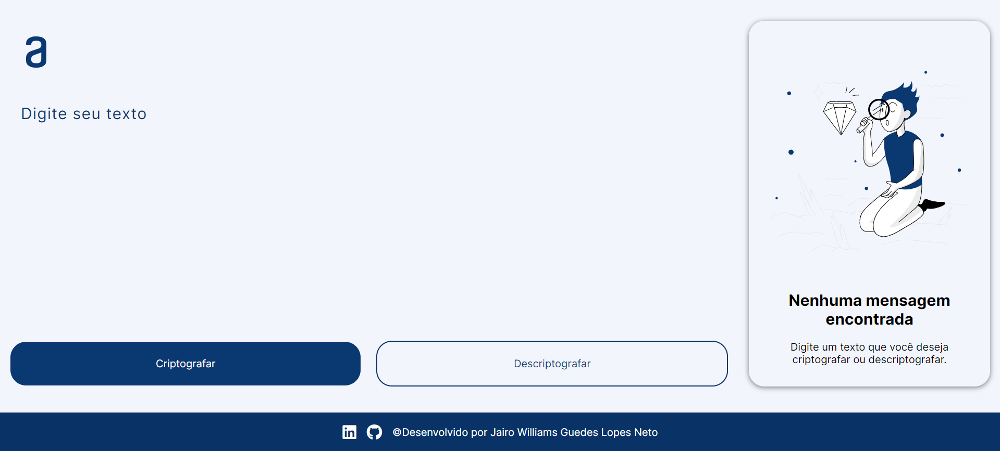

# 🧑‍💻 Decodificador de Texto: Criptografe e Descriptografe!




> Este projeto foi feito ao decorrer do Challange "Decodificador de Texto", da Alura em parceria com a ONE - Oracle Next Education. O princípio deste é para mostrar o conhecimento aprendido durante a formação "Iniciante em Programação", da Alura.
> #challengeonedecodificador5

### Ajustes e melhorias

- [ ] Aprimorar a lógica da criptografia e descriptografia. 


## 💻 Pré-requisitos

Antes de começar, verifique se você atendeu aos seguintes requisitos:

- Você instalou a versão mais recente do `Visual Studio Code / Extensão: LiveServer / Git / GitBash`

## 🚀 Instalando o Decodificador

Para instalar o Decodificador a sua máquina, siga este passo a passo:
1. Crie uma pasta vazia para no futuro clonar o projeto. Pode inserir qualquer nome nela.

2. Após criá-la, entre no GitBash e utilize o comando 'cd' + o caminho onde a pasta se encontra. Ex:
```
cd d:/Pasta-ONE-Challange-Decodificador
```
3. Após entrar na pasta, tilize o Comando 'git init'.
```
$ git init
```
4. Depois de inicializar o Git, crie uma branch local:
```
$ git branch -M main
```
5. Após criar a sua branch, é só clonar este repositório utilizando este comando:
```
$ git clone https://github.com/JairoNetoDev/ONE-Challange-Decodificador.git
```
6. Abra o VSCode e coloque a pasta clonada em um novo Workspace:
```
Open Folder -> Pasta_Clonada -> Add
```
7. Entre no arquivo 'index.html', clique com o botão direito do mouse e clique em 'Open With Live Server'.

## ☕ Usando o Decodificador

Para usar Decodificador, se atente as regras:

1. Utilize apenas letras minúsculas e sem caractéres especiais.

2. Descubra qual é a lógica por trás da criptografia!
